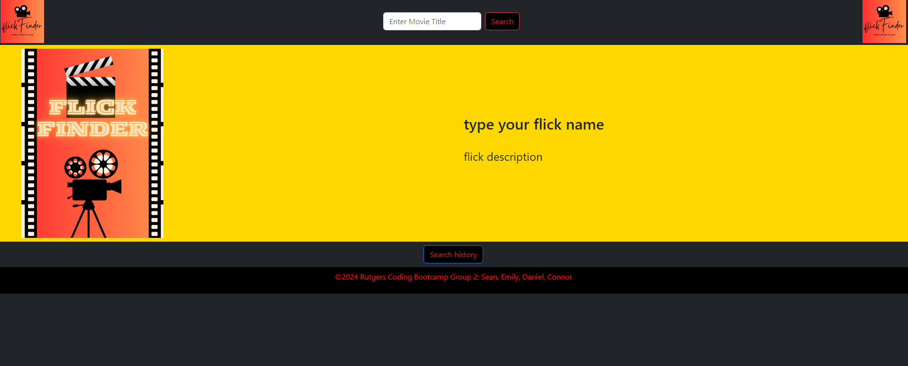

# Flick Finder

()

## Table of Contents
Description

Motivation for Development

User Story

Technologies Used

Challenges

Successes

Directions for Future Development

## Description
 The web app we created utilizes the OMDB API to pull movie data such as the movie title, movie poster, and movie description. Users can access this information by making API requests through the app.

 ## Motivation for Development
 The motivation behind developing this web app was to create a platform where users can easily search for movie information without having to navigate through multiple websites. By utilizing the OMDB API, we are able to provide users with a convenient way to access movie details all in one place.

## User Story
As a user, I want to be able to search for a movie and retrieve its title, poster, and description. This will allow me to quickly gather information about a movie without having to visit multiple websites or platforms. Additionally, I want the app to be user-friendly and provide a seamless experience when searching for movies.

## Technologies Used: 

The project utilizes a range of technologies commonly used in full stack application development. This includes HTML, CSS, JavaScript, and a CSS framework Bootstrap. 

## Challenges 
Working in a team setting presents its own set of challenges. Some of our challenges included merge conflicts within our VScode and styling/laying out our content without breaking our JavaScript code. Effective communication, time management, and coordination were crucial to ensure a smooth progress of the project.  

## Successes
Throughout the project, the team had the opportunity to learn from each other, share knowledge, and leverage each other’s strengths. Collaboration fostered creativity, problem-solving, and a deeper understanding of the development process. The team’s success was measured not only by the completion of the application but also by the quality of the final product.

## Directions for Future Development
Incorporate a Genre finder 
Incorporate a favorites selection so that the user can create favorite movie list to watch 
Incorporate option to create an account

[Flick Finder link] (https://dann9109.github.io/movieapp/
)
